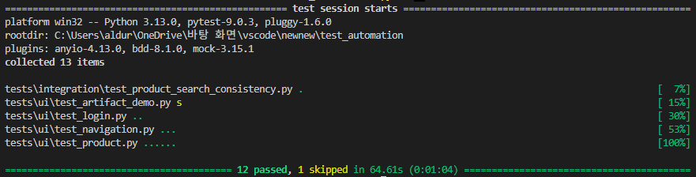

# pytest-bdd, Playwright 기반 E2E 테스트 자동화 프로젝트

## 프로젝트 개요

테스트 대상은 테스트 자동화 연습용 웹사이트 Automation Exercise이며, 사용자의 주요 서비스 이용 흐름을 Playwright 기반의 브라우저 자동화로 검증합니다. 테스트 시나리오는 pytest-bdd를 사용해 Gherkin 문법으로 작성하여 테스트 의도를 명확히 표현하고, Page Object Model(POM) 패턴을 적용해 코드의 재사용성과 확장성을 높였습니다.

또한 API 응답 데이터와 UI 표시 데이터 간의 일관성을 검증하고, 테스트 실패 시 분석에 필요한 artifacts를 저장하도록 구성했습니다.

---

## 프로젝트 개요

[Automation Exercise](https://automationexercise.com/)(테스트 자동화 데모 사이트)를 대상으로 Playwright, pytest, pytest-bdd를 활용해 구현한 E2E 테스트 자동화 프로젝트입니다.

로그인, 페이지 이동, 상품 추가/삭제 기능, 상품 검색 결과의 API/UI 일관성 검증을 포함하며, 테스트 실패 시 스크린샷과 Playwright trace를 저장하도록 구성했습니다.

자세한 설계 의도와 이슈 해결 과정은 [프로젝트 보고서](https://www.notion.so/pytest-bdd-Playwright-E2E-35d5fd48d31780d588c2f8a73986846f?source=copy_link)에서 확인할 수 있습니다.

## 기술 스택

| 구분              | 기술              | 사용 목적                                                   |
| ----------------- | ----------------- | ----------------------------------------------------------- |
| 언어              | Python            | 테스트 코드 작성                                            |
| 테스트 프레임워크 | pytest            | 테스트 실행 및 fixture 관리                                 |
| BDD 프레임워크    | pytest-bdd        | Gherkin 기반 테스트 시나리오 작성                           |
| 브라우저 자동화   | Playwright        | 브라우저 기반 E2E 테스트 자동화                             |
| API 클라이언트    | requests          | API 요청/응답 데이터 조회 및 UI 표시 데이터와의 일관성 검증 |
| 디자인 패턴       | Page Object Model | 페이지별 동작과 검증 로직 분리                              |

pytest-bdd의 시나리오 매핑 기능을 활용해 테스트 실행 흐름을 구성했으며, Playwright를 통해 실제 브라우저 환경에서 사용자 동작을 검증하고,
Python requests로 API 응답 데이터를 조회해 UI 데이터와 비교했습니다.

## 주요 구현 포인트

- POM 기반으로 페이지별 locator, action, assertion(expect) 분리
- pytest-bdd를 활용한 Given-When-Then 시나리오 구성
- ProductCard, CartModal 등 페이지 별 반복 UI 요소를 component object로 분리
- 상품 검색 API 응답과 UI 검색 결과의 상품 ID 일관성 검증
- 테스트 실패 시 screenshot 및 Playwright trace 저장

## 프로젝트 구조

```text
test_automation/
├── common/            # 공통 액션 및 검증 로직
├── components/        # 재사용 가능한 UI 컴포넌트 객체
├── pages/             # 화면 단위 Page Object
├── tests/
│   ├── api/clients    # API 요청 클라이언트
│   ├── integration/   # API/UI 일관성 검증 테스트
│   └── ui/            # BDD 기반 UI 테스트
│       ├── features/  # Gherkin 시나리오
│       ├── steps/     # 시나리오별 step 구현
│       └── test_*.py  # pytest-bdd 시나리오 실행 파일
├── README.md
├── conftest.py        # pytest fixture 및 실행 환경 설정
└── requirements.txt
```

이 프로젝트는 POM 패턴을 기반으로 UI 조작 로직과 테스트 시나리오를 분리했습니다.

`common`에서 각 페이지의 공통 액션과 검증을 정의하고, `pages` 디렉터리에는 화면 단위의 Page Object를 배치했습니다.

`components`에서는 product card, cart modal처럼 여러 페이지에서 재사용될 수 있는 UI 컴포넌트 객체를 분리했습니다.

`tests/ui/features`에는 Gherkin 문법으로 작성한 BDD 시나리오를 두고, `tests/ui/steps`에는 각 시나리오와 매핑되는 step 구현을 배치했습니다.

또한 `tests/api/clients`에는 API 응답 데이터를 조회하기 위한 클라이언트를 두고, `tests/integration`에서는 API 응답 데이터와 UI 표시 데이터 간의 일관성을 검증합니다.

상세 내용은 [프로젝트 보고서](https://www.notion.so/pytest-bdd-Playwright-E2E-35d5fd48d31780d588c2f8a73986846f?source=copy_link#3635fd48d31780a889ccfa67027fb04d)에서 확인할 수 있습니다.

## 테스트 시나리오

### UI 테스트

| Feature    | 검증 내용                                                                                  |
| ---------- | ------------------------------------------------------------------------------------------ |
| Login      | 올바른 계정으로 로그인 성공 여부와 잘못된 계정 입력 시 로그인 실패 여부 검증               |
| Navigation | 홈 화면에서 Login, Products, Cart 페이지로 정상 이동하는지 검증                            |
| Products   | 상품 추가 버튼 동작, 상품 추가 확인 modal 표시, Continue Shopping/View Cart 버튼 동작 검증 |
| Cart       | 단일 상품 및 여러 상품의 장바구니 추가 여부와 장바구니 내 상품 삭제 동작 검증              |

### Integration 테스트

| 테스트                     | 검증 내용                                                                                                                                 |
| -------------------------- | ----------------------------------------------------------------------------------------------------------------------------------------- |
| 상품 검색 결과 일관성 검증 | 동일한 검색어로 조회한 UI 상품 목록과 API 응답 상품 목록을 비교하여 UI에 표시된 상품 ID와 API 응답 데이터에서 추출한 ID가 일치하는지 검증 |

UI 테스트는 `tests/ui/features`의 Gherkin 시나리오를 기준으로 작성했으며, 각 시나리오는 `tests/ui/steps`의 step 구현과 매핑됩니다.  
Integration 테스트에서는 Python `requests` 기반 API 클라이언트를 사용해 상품 검색 API 응답을 조회하고, Playwright로 수집한 UI 상품 데이터와 비교합니다.

### 실패 테스트

| 테스트                     | 검증 내용                                                                          |
| -------------------------- | ---------------------------------------------------------------------------------- |
| 의도적으로 실패하는 테스트 | 테스트 실패 시 정상적으로 Skip처리되며, `artifacts/`에 유관 파일이 저장되는지 확인 |

## 실행 방법

### 1. 저장소 클론

```bash
git clone https://github.com/HwangMinHyeok/test_automation.git
cd test_automation
```

### 2. 가상환경 생성 및 활성화

```bash
python -m venv .venv
```

Windows:

```bash
.venv\Scripts\activate
```

macOS/Linux:

```bash
source .venv/bin/activate
```

### 3. 의존성 설치

```bash
pip install -r requirements.txt
playwright install chromium
```

### 4. 테스트 실행

전체 테스트 실행:

```bash
pytest
```

UI 테스트 실행:

```bash
pytest tests/ui
```

Integration 테스트 실행:

```bash
pytest tests/integration
```

테스트는 기본적으로 Chromium 브라우저를 headless 모드로 실행합니다.  
테스트 실패 시 `artifacts/screenshots`와 `artifacts/traces` 디렉터리에 실패 분석을 위한 파일이 저장됩니다.

## 실패 분석 자료

테스트 실패 시 실패 원인을 분석할 수 있도록 스크린샷과 Playwright trace 파일을 저장합니다.

```text
artifacts/
├── screenshots/
│   └── {test_nodeid}.png
└── traces/
    └── {test_nodeid}.zip
```

| 저장 항목        | 경로                     | 설명                                                                         |
| ---------------- | ------------------------ | ---------------------------------------------------------------------------- |
| Screenshot       | `artifacts/screenshots/` | 실패 시점의 전체 화면 캡처                                                   |
| Playwright trace | `artifacts/traces/`      | 테스트 실행 흐름, DOM snapshot, 네트워크 요청 등을 확인할 수 있는 trace 파일 |

Playwright trace 파일은 아래 명령어로 확인할 수 있습니다.

```bash
playwright show-trace artifacts/traces/{trace_file}.zip
```

## 테스트 실행 결과

전체 테스트는 아래 명령어로 실행했습니다.

```bash
pytest
```



전체 테스트가 정상적으로 통과하는 것을 확인했습니다.
실패 테스트(test_artifact_demo.py)가 의도대로 skip되는 것을 확인했습니다.
